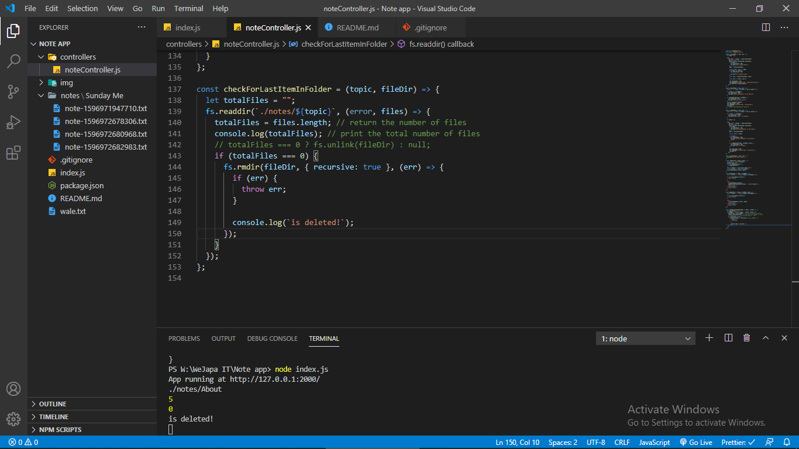

# Note App built with Node js

### To CREATE a note with the POST request

- Add topic and note as parameters in the body

### To DELETE a note with the DELETE request

- Add topic and fileName to the url ie. /note/{topic}/{fileName}

### To UPDATE a note with the PATCH request

- Add topic and fileName to the url ie. /note/{topic}/{fileName}

### Method that checks for last item in FOLDER to DELETE the entire FOLDER

